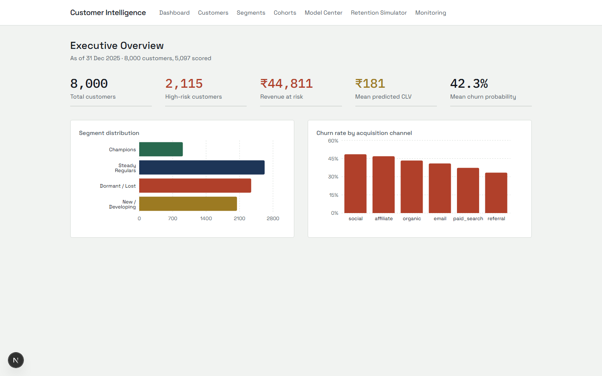
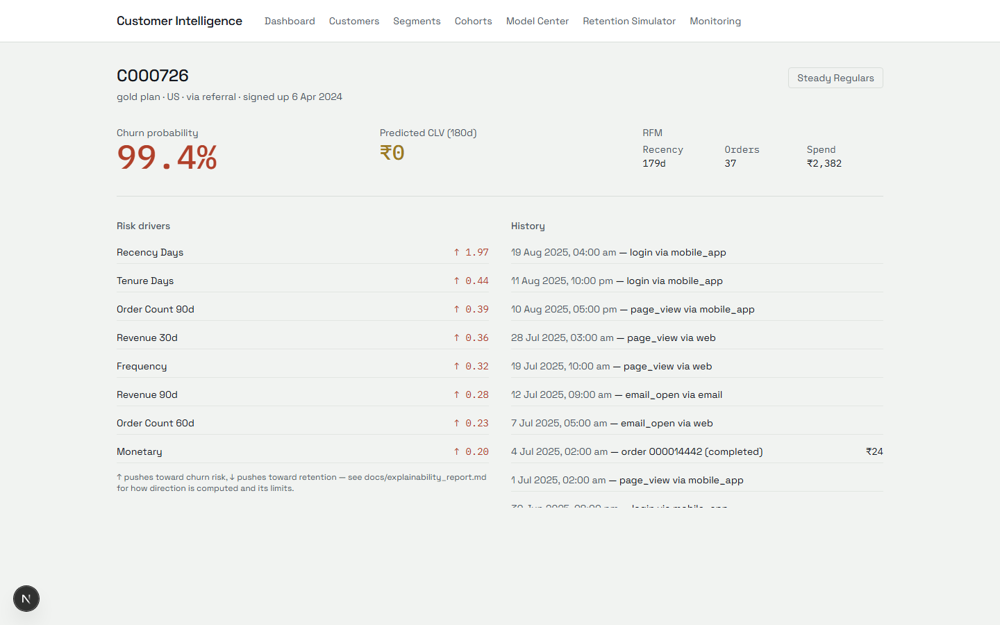
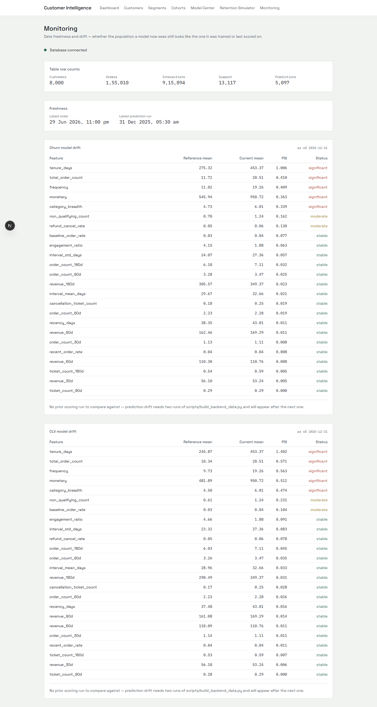
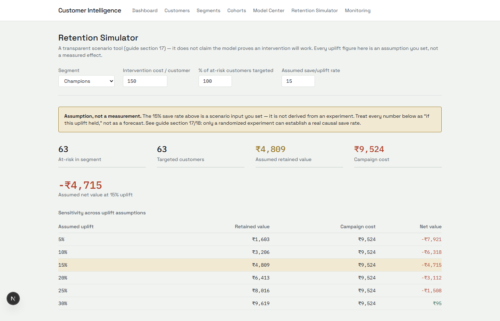

# Customer Intelligence Platform

Churn prediction + predictive customer lifetime value (CLV) + behavioral
segmentation + customer-360 analytics + cohort/retention analytics +
explainability + a transparent retention-campaign simulator — a full
product build (synthetic data generator → ML → FastAPI/PostgreSQL →
Next.js dashboard → MLOps), not a notebook-only churn project.

Full product/module spec: `Customer_Intelligence_Platform_Complete_Project_Guide.docx`.
Architecture and roadmap status: [`docs/architecture.md`](docs/architecture.md).
Churn/CLV definitions and the point-in-time design: [`docs/target_definition.md`](docs/target_definition.md).
Table-by-table schema: [`docs/data_dictionary.md`](docs/data_dictionary.md).

## Results at a glance

Every number below is reproduced, sourced output — cited from the doc
that derives it, not restated from memory.

| | |
|---|---|
| Churn model | XGBoost, **PR-AUC 0.735**, **3.0x lift** in the top decile vs. random targeting, time-based held-out test split (`docs/model_card.md`) |
| CLV | Two approaches compared honestly (XGBoost regression vs. BG/NBD + Gamma-Gamma) — neither dominates the other (`docs/clv_methodology.md`) |
| Segmentation | K-Means, k=4 chosen over the silhouette-maximizing k=2 for business usability, cross-checked against hierarchical clustering via Adjusted Rand Index (`docs/segmentation_report.md`) |
| Explainability | SHAP, global + local drivers with a feature-value/SHAP correlation for *direction* — a plain mean-SHAP washes out for two-sided features like recency (`docs/explainability_report.md`) |
| Drift monitoring | PSI-based feature + prediction drift; the first real run correctly flags 10 tenure-linked features as drifted and explains why from the data, rather than a synthetic pass/fail (`docs/monitoring.md`) |
| Backend | FastAPI + PostgreSQL, on-demand `/predict/*` scoring verified to match batch-precomputed predictions exactly, not just "returns 200" (`docs/api_reference.md`) |
| Frontend | Next.js 16 dashboard, all 8 guide-specified pages, verified end-to-end against the live backend in a real browser, not just a passing build |

## Screenshots

Real data, captured against the live backend — not mockups.

| | |
|---|---|
|  Executive dashboard: segment mix and churn by acquisition channel |  Customer 360: churn probability, RFM, and signed SHAP drivers |
|  Monitoring: PSI feature drift, reference vs. current mean per feature |  Retention simulator: campaign economics with the uplift input labeled as an assumption |

## What this demonstrates

- **Point-in-time-safe ML**: every feature and label is computed as of
  an explicit cutoff, validated across quarterly snapshots rather than
  a random split, because the same `customer_id` recurs across
  snapshots and a random split would leak identity-level signal
  (`docs/target_definition.md`, `docs/model_card.md`).
- **Honest evaluation over cherry-picked wins**: the champion model is
  picked on validation and *then* the test numbers are reported for
  every candidate, including the one where XGBoost's validation win
  reverses on test by a statistically negligible margin
  (`docs/model_card.md`, "Honest note").
- **Batch-serving discipline**: dashboard numbers are never computed
  inline in a request handler — they're precomputed by
  `scripts/build_backend_data.py` and read back, the same pattern a
  real production system uses to keep request latency independent of
  model inference cost (`docs/api_reference.md`).
- **Monitoring that explains itself**: drift results come with
  reference/current means alongside the PSI score specifically so a PSI
  spike is diagnosable, not just alarmable (`docs/monitoring.md`).
- **Decision support, not just prediction**: the retention simulator
  computes campaign economics from live segment data but labels its own
  uplift assumption as an assumption, never as a measured effect
  (`frontend/components/RetentionSimulator.tsx`).

## Setup

```powershell
cd Customer_Intelligence_Platform
python -m venv .venv
.venv\Scripts\Activate.ps1
pip install -e ".[dev]"

# generate the synthetic dataset (writes data/raw/*.parquet, gitignored)
python scripts/generate_data.py

# run the data-quality test suite
pytest
```

A 200-customer sample of the generated data is committed under
`data/samples/` so you can inspect the shape of the data without running
the generator. For the full backend + dashboard (Phases 9-11), see
`docs/api_reference.md` and `frontend/README.md`; for running it in
Docker instead of directly on the host, see `docs/deployment.md`.

## Documentation

| Doc | Covers |
|---|---|
| [`docs/target_definition.md`](docs/target_definition.md) | Churn/CLV business definitions, the point-in-time design |
| [`docs/data_dictionary.md`](docs/data_dictionary.md) | Table-by-table schema |
| [`docs/eda_report.md`](docs/eda_report.md) | Exploratory findings that motivated the feature set |
| [`docs/model_card.md`](docs/model_card.md) | Churn model comparison, calibration, segment error analysis |
| [`docs/clv_methodology.md`](docs/clv_methodology.md) | CLV: XGBoost regression vs. BG/NBD + Gamma-Gamma |
| [`docs/segmentation_report.md`](docs/segmentation_report.md) | K-Means segments, naming, hierarchical cross-check |
| [`docs/explainability_report.md`](docs/explainability_report.md) | SHAP global/local drivers, prediction-vs-causation caveat |
| [`docs/api_reference.md`](docs/api_reference.md) | FastAPI endpoints, batch-vs-on-demand serving design |
| [`docs/monitoring.md`](docs/monitoring.md) | MLflow tracking, PSI drift methodology and a real worked example |
| [`docs/deployment.md`](docs/deployment.md) | Docker images, what's needed to deploy each piece |
| [`docs/architecture.md`](docs/architecture.md) | Repository layout, data flow, the full 12-phase roadmap status |

## Why synthetic data

The guide recommends a public transactional/e-commerce dataset, but this
repo generates its own instead: it gives full control over the
point-in-time churn/CLV design (`docs/target_definition.md`) and bakes in
a real dropout process (declining engagement before churn, refunds,
support friction correlated with churn) so downstream modeling has
genuine signal to find — rather than fighting an unknown real dataset's
quirks before the pipeline itself is validated. `src/data/generator.py`
documents the exact simulation.

## Repository layout

See [`docs/architecture.md`](docs/architecture.md#repository-layout).
